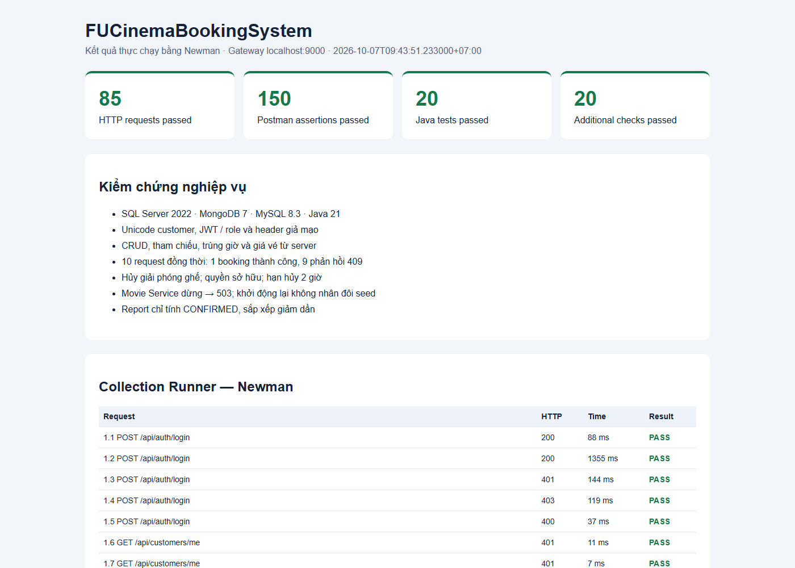

# FUCinemaBookingSystem — Assignment 1

Hệ thống gồm 3 microservice độc lập và API Gateway MVC. Java 21,
Spring Boot **4.1.0**, Spring Cloud **2025.1.3**; Maven quản lý build.

| Ứng dụng | Port | Database |
|---|---:|---|
| customer-service | 8081 | SQL Server 2022 · cinema_customer |
| movie-service | 8082 | MongoDB 7 · cinema_movie |
| booking-service | 8083 | MySQL 8.3 · cinema_booking |
| api-gateway | 9000 | JWT HS256 và phân quyền ADMIN/CUSTOMER |

## Khởi động

Chạy các lệnh dưới đây tại thư mục `fu-cinema`, dùng Java 21, Maven và
Docker Desktop đang chạy Linux containers:

```powershell
docker compose up -d
docker compose ps -a
mvn clean verify
```

SQL Server phải `healthy`, `sqlserver-init` phải `Exited (0)`, MongoDB và
MySQL phải `Up`. Compose chờ SQL Server sẵn sàng trước khi tạo database.

Máy hiện có SQL Server/MySQL cài sẵn, nên database Docker dùng host port
**1435** và **3307**. Port bên trong container vẫn là 1433 và 3306.
Có thể đặt `SQLSERVER_PORT` / `MYSQL_PORT` trước khi chạy cả Compose và Java
để đổi host port; giá trị mặc định trong datasource khớp Compose.

Sau khi build, mở bốn terminal tại `fu-cinema`, chạy theo thứ tự:

```powershell
java -jar customer-service/target/customer-service-0.0.1-SNAPSHOT.jar
java -jar movie-service/target/movie-service-0.0.1-SNAPSHOT.jar
java -jar booking-service/target/booking-service-0.0.1-SNAPSHOT.jar
java -jar api-gateway/target/api-gateway-0.0.1-SNAPSHOT.jar
```

Mỗi terminal chạy một lệnh. Đợi thông báo `Started ...Application` trước
khi kiểm thử. Tất cả API client gọi qua `http://localhost:9000`.

## Tài khoản seed

| Email | Password | Quyền / trạng thái |
|---|---|---|
| admin@fucinema.com | @@abc123@@ | ADMIN, cấu hình trong properties |
| an@gmail.com | 123456 | CUSTOMER / ACTIVE |
| binh@gmail.com | 123456 | CUSTOMER / ACTIVE |
| chi@gmail.com | 123456 | CUSTOMER / INACTIVE, login trả 403 |

Customer dùng BCrypt, response không chứa password. Customer chỉ xem/hủy
booking của mình. Gateway xóa ba header ngữ cảnh từ client và thay bằng
`uid`, `sub`, `role` từ JWT đã xác minh.

## Kiểm thử

Import hai file sau vào Postman, chọn environment `FUCinema-Local`, rồi
chạy toàn bộ collection theo thứ tự bằng Collection Runner:

- `postman/FUCinemaBookingSystem.postman_collection.json`
- `postman/FUCinema-Local.postman_environment.json`

Collection tạo email, genre, room, movie và showtime để các request sau
sử dụng. Các giá trị token/ID được lưu trong environment lúc chạy.
Test 3.6 dùng genre seed **Khoa học viễn tưởng** vì có phim tham chiếu;
genre Hành động trong guide không có phim nên không phù hợp để test BR03.

Có thể chạy cùng collection bằng Newman:

```powershell
npx --yes newman run postman/FUCinemaBookingSystem.postman_collection.json -e postman/FUCinema-Local.postman_environment.json
```

Kết quả thực chạy ngày **07/10/2026**, múi giờ Asia/Bangkok:

- `mvn clean verify`: **20 test Java pass**, 0 failure/error.
- Newman: **85 request, 150 assertion pass**, 0 failure.
- **20 kiểm tra bổ sung pass**: đặt ghế đồng thời, rollback, giải phóng ghế,
  hạn hủy 2 giờ, lịch chiếu tiếp giáp/trùng giờ khi sửa, token hết hạn/sai
  chữ ký, Movie Service dừng trả 503 và seed không nhân đôi khi restart.
- Report được kiểm tra với **hai phim**, doanh thu giảm dần và tổng khớp.
- Database thật xác nhận Unicode NVARCHAR, Decimal128, unique index và
  ObjectId snapshot lưu trong VARCHAR(24); Flyway V1/V2 thành công.

Mở [báo cáo HTML](postman/test-report.html) để xem từng request. Dữ liệu
kết quả nằm trong `test-results.json`, `extra-test-results.json` và
`database-verification.json`; ảnh bên dưới chụp báo cáo của lượt chạy Newman.



## Những điểm triển khai cần lưu ý

- MySQL dùng bảng `active_seat` với khóa chính `(showtime_id, seat_code)`.
  Booking và reservation được ghi trong cùng transaction; xung đột trả
  409 và rollback toàn bộ. Hủy xóa reservation nhưng giữ lịch sử vé.
- Showtime dùng khoảng nửa mở `[startTime, endTime)`; suất liền kề được
  phép, suất SCHEDULED chồng giờ trong cùng phòng bị từ chối.
- Feign gọi thẳng Movie Service, timeout kết nối 1 giây, đọc 3 giây.
- Seeder kiểm tra từng collection riêng và chỉ nạp collection rỗng.
- Report lấy từ snapshot vé, chỉ tính CONFIRMED trong khoảng từ đầu
  startDate đến trước đầu ngày kế tiếp endDate.

## Lịch sử Git và nộp bài

Nhánh làm bài: **Assignment-1**. Mỗi TODO có commit riêng hoặc commit bổ
sung với footer `Refs: TODO x.y`, theo Conventional Commits.
Xem `../ANALYSIS.md` để đối chiếu từng yêu cầu và phụ thuộc triển khai.

Hai file Word được giữ tại thư mục Assignment 1 và được `.gitignore`
loại khỏi commit. Build output, dữ liệu container và file làm việc tạm
không nằm trong source đã commit.

Để dừng ứng dụng, dùng Ctrl+C ở từng terminal; dừng database bằng
`docker compose stop`. Dữ liệu database được giữ cho lần chạy tiếp theo.
